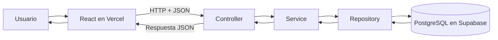
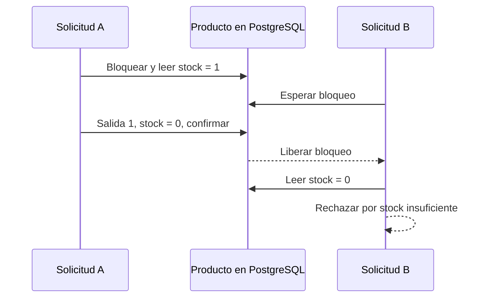
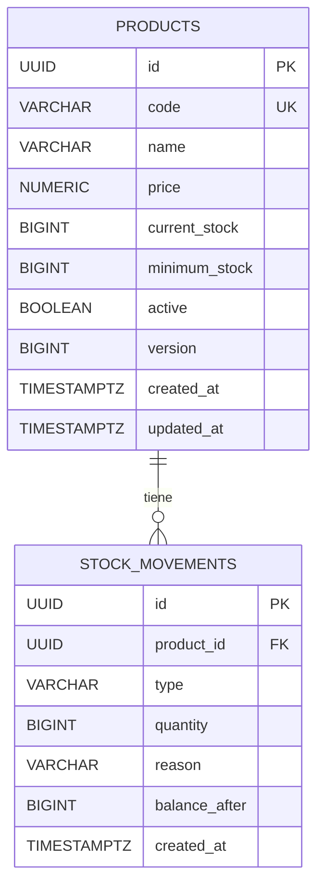
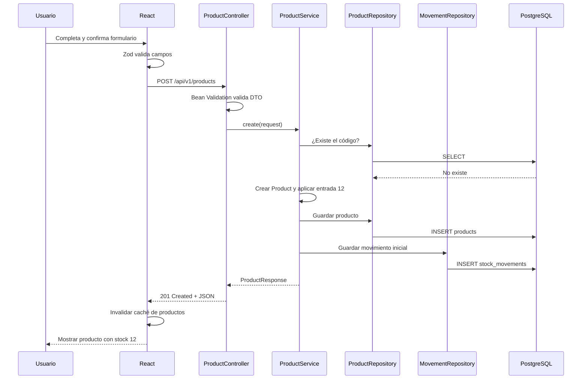
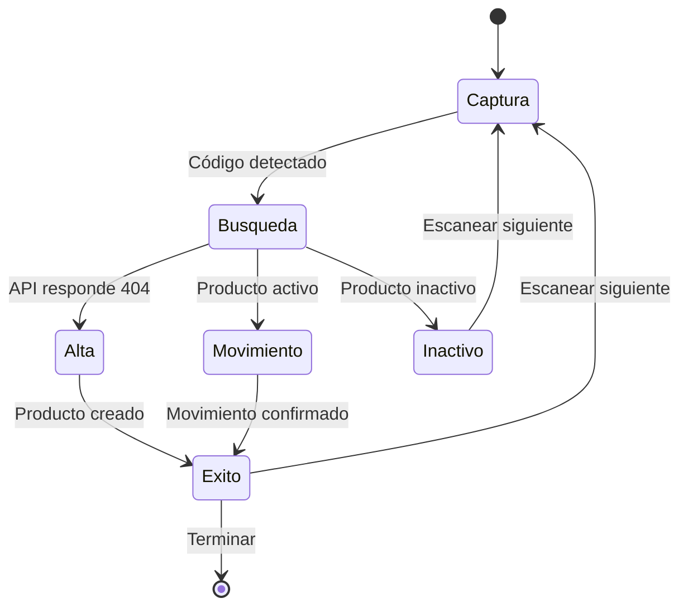
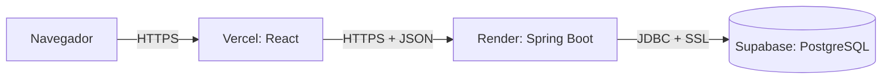
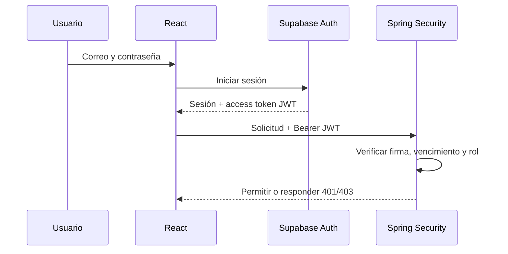

# Guía de estudio del proyecto Stock Control MVP

Esta guía explica, desde lo más básico, cómo está construida la aplicación de control de stock. La idea no es solamente enseñarte qué archivos existen, sino ayudarte a entender **por qué existen**, cómo se relacionan y qué recorrido realiza la información.

> Estado descrito por esta guía: catálogo de productos, entradas y salidas, alertas de stock bajo, historial, lectura de códigos de barras y despliegue. La autenticación con administrador y usuario normal todavía no está implementada.

## Índice

1. [Qué construimos](#1-qué-construimos)
2. [Conceptos básicos](#2-conceptos-básicos)
3. [Arquitectura general](#3-arquitectura-general)
4. [Estructura del repositorio](#4-estructura-del-repositorio)
5. [Backend con Spring Boot](#5-backend-con-spring-boot)
6. [Base de datos PostgreSQL](#6-base-de-datos-postgresql)
7. [Frontend con React](#7-frontend-con-react)
8. [Cómo viaja una solicitud completa](#8-cómo-viaja-una-solicitud-completa)
9. [Lectura de códigos de barras](#9-lectura-de-códigos-de-barras)
10. [API y HTTP](#10-api-y-http)
11. [Validaciones y manejo de errores](#11-validaciones-y-manejo-de-errores)
12. [Ejecución local](#12-ejecución-local)
13. [Despliegue en producción](#13-despliegue-en-producción)
14. [Pruebas automáticas](#14-pruebas-automáticas)
15. [Git y GitHub](#15-git-y-github)
16. [Seguridad actual y próxima etapa](#16-seguridad-actual-y-próxima-etapa)
17. [Ruta recomendada de estudio](#17-ruta-recomendada-de-estudio)
18. [Ejercicios para practicar](#18-ejercicios-para-practicar)
19. [Glosario](#19-glosario)

---

## 1. Qué construimos

Stock Control MVP es una aplicación web para una tienda. Permite:

- Crear y editar productos.
- Asignar un código comercial o código de barras único.
- Definir precio y stock mínimo.
- Cargar stock inicial.
- Registrar entradas y salidas de unidades.
- Impedir salidas que dejarían el stock en negativo.
- Detectar productos con stock bajo o sin existencias.
- Consultar el historial de movimientos.
- Leer códigos de barras con cámara, lector USB o entrada manual.
- Usar la aplicación desde computadora o teléfono.

La aplicación publicada está dividida en tres partes:

| Parte | Tecnología | Alojamiento | Responsabilidad |
|---|---|---|---|
| Frontend | React + TypeScript | Vercel | Pantallas e interacción con el usuario |
| Backend | Java + Spring Boot | Render | Reglas de negocio y API REST |
| Base de datos | PostgreSQL | Supabase | Almacenamiento permanente |

### Una analogía sencilla

Imagina un restaurante:

- El **frontend** es el camarero: escucha lo que pide la persona y presenta el resultado.
- El **Controller** es quien recibe la comanda y entiende qué operación se solicitó.
- El **Service** es la cocina: aplica las reglas para preparar correctamente el pedido.
- El **Repository** es quien entra a la despensa a buscar o guardar ingredientes.
- La **base de datos** es la despensa donde la información queda almacenada.
- La **Entity** describe qué forma tienen los elementos guardados en la despensa.

---

## 2. Conceptos básicos

### 2.1 Cliente y servidor

El navegador es el **cliente**. Spring Boot es el **servidor**.

El cliente envía una solicitud:

```http
GET /api/v1/products
```

El servidor responde con JSON:

```json
{
  "content": [],
  "page": {
    "number": 0,
    "size": 20,
    "totalElements": 0,
    "totalPages": 0
  }
}
```

JSON es un formato de texto utilizado para intercambiar datos.

### 2.2 API REST

Una API es una puerta de entrada controlada al backend. REST organiza esa puerta mediante rutas y métodos HTTP.

Ejemplos:

- `GET /api/v1/products`: consultar productos.
- `POST /api/v1/products`: crear un producto.
- `PUT /api/v1/products/{id}`: actualizar un producto.
- `PATCH /api/v1/products/{id}/status`: cambiar su estado.

### 2.3 Estado

La palabra estado puede significar dos cosas:

1. **Estado almacenado:** datos permanentes, por ejemplo el stock actual en PostgreSQL.
2. **Estado de interfaz:** datos temporales de React, por ejemplo si un formulario está abierto.

### 2.4 Transacción

Una transacción agrupa varias operaciones de base de datos como una sola unidad.

Al crear un producto con stock inicial hacemos dos cosas:

1. Guardamos el producto.
2. Guardamos el movimiento `Inventario inicial`.

Si la segunda falla, tampoco debe quedar guardada la primera. Eso se conoce como **atomicidad**: ocurre todo o no ocurre nada.

---

## 3. Arquitectura general



La regla principal es que cada capa tenga una responsabilidad clara:

| Capa | Pregunta que responde |
|---|---|
| Controller | ¿Qué ruta se llamó y qué datos llegaron? |
| Service | ¿Qué reglas debe cumplir la operación? |
| Repository | ¿Cómo leo o guardo datos? |
| Entity | ¿Cómo es el objeto del dominio y qué comportamiento tiene? |
| DTO | ¿Qué datos entran o salen por la API? |
| Mapper | ¿Cómo convierto una Entity en un DTO? |

### Por qué no ponemos todo en el Controller

Un Controller enorme sería difícil de probar y mantener. Al separar responsabilidades podemos:

- Cambiar una regla de stock sin tocar las rutas HTTP.
- Probar el Service sin iniciar un navegador.
- Cambiar la forma de respuesta sin modificar la tabla.
- Entender más rápido dónde buscar un error.

---

## 4. Estructura del repositorio

```text
proyecto spring boot/
├── src/main/java/com/tienda/inventario/
│   ├── config/          Configuración de CORS y OpenAPI
│   ├── controller/      Rutas HTTP
│   ├── dto/             Datos de entrada y salida
│   ├── entity/          Modelo de dominio y entidades JPA
│   ├── exception/       Errores y respuestas uniformes
│   ├── mapper/          Conversión Entity -> DTO
│   ├── repository/      Acceso a PostgreSQL
│   ├── service/         Reglas de negocio
│   └── InventoryApplication.java
├── src/main/resources/
│   ├── application.yml
│   └── db/migration/V1__initial_schema.sql
├── src/test/java/       Pruebas del backend
├── frontend/
│   ├── src/features/    Pantallas agrupadas por funcionalidad
│   ├── src/lib/         Cliente común de la API
│   ├── src/App.tsx      Navegación y rutas
│   └── src/main.tsx     Inicio de React
├── docs/                Material de estudio
├── pom.xml              Dependencias y construcción de Java
├── compose.yaml         PostgreSQL local con Docker
├── Dockerfile           Imagen del backend para producción
├── render.yaml          Configuración de Render
└── README.md            Presentación y uso rápido
```

### Archivos de configuración importantes

- `pom.xml`: proyecto Maven y dependencias del backend.
- `frontend/package.json`: dependencias y comandos del frontend.
- `application.yml`: conexión a base de datos, puerto y CORS.

Las variables necesarias se declaran en la configuración de la aplicación, pero sus valores secretos se cargan directamente en Render, Supabase o archivos locales ignorados por Git. Nunca se guardan contraseñas reales en el repositorio.

---

## 5. Backend con Spring Boot

### 5.1 Maven y `pom.xml`

Maven descarga librerías, compila Java y ejecuta pruebas. El wrapper `mvnw.cmd` permite usar la versión prevista por el proyecto.

Dependencias principales:

| Dependencia | Uso |
|---|---|
| Spring Web MVC | Controllers y solicitudes HTTP |
| Spring Data JPA | Repositories y persistencia |
| Validation | Anotaciones como `@NotBlank` |
| Flyway | Versionado de estructura SQL |
| Actuator | Endpoint de salud |
| Springdoc OpenAPI | Swagger UI |
| PostgreSQL Driver | Conexión JDBC con PostgreSQL |
| JUnit, Mockito y Testcontainers | Pruebas |

El proyecto utiliza Java 21 y Spring Boot 4.1.

### 5.2 Punto de entrada

`InventoryApplication.java` contiene:

```java
@SpringBootApplication
public class InventoryApplication {
    public static void main(String[] args) {
        SpringApplication.run(InventoryApplication.class, args);
    }
}
```

`@SpringBootApplication` le indica a Spring que:

- Inicie la aplicación.
- Busque componentes en `com.tienda.inventario` y sus subpaquetes.
- Configure automáticamente servidor web, JPA y demás dependencias.

### 5.3 Inyección de dependencias

En lugar de crear objetos manualmente con `new`, Spring los construye y conecta.

Ejemplo conceptual:

```java
public ProductController(ProductService productService) {
    this.productService = productService;
}
```

Spring encuentra `ProductService` porque tiene `@Service`, crea una instancia y la entrega al Controller. Esto se llama **inyección de dependencias**.

### 5.4 Entity: el modelo persistente

`Product` tiene `@Entity`, por lo que JPA lo relaciona con la tabla `products`.

Campos principales:

| Java | PostgreSQL | Significado |
|---|---|---|
| `id` | `UUID` | Identificador interno único |
| `code` | `VARCHAR(50)` | SKU o código de barras |
| `name` | `VARCHAR(150)` | Nombre visible |
| `price` | `NUMERIC(19,2)` | Precio exacto con decimales |
| `currentStock` | `BIGINT` | Unidades actuales |
| `minimumStock` | `BIGINT` | Nivel de alerta |
| `active` | `BOOLEAN` | Indica si admite operaciones |
| `version` | `BIGINT` | Control de concurrencia de JPA |
| `createdAt` | `TIMESTAMPTZ` | Momento de creación |
| `updatedAt` | `TIMESTAMPTZ` | Última actualización |

La Entity también contiene comportamiento:

```java
public long applyEntry(long quantity) {
    this.currentStock = Math.addExact(this.currentStock, quantity);
    return this.currentStock;
}
```

```java
public long applyExit(long quantity) {
    if (quantity > this.currentStock) {
        throw new IllegalArgumentException("Insufficient stock");
    }
    this.currentStock -= quantity;
    return this.currentStock;
}
```

Esto es importante: el producto protege su propia regla de no quedar negativo.

`StockMovement` representa un movimiento inmutable. Guarda el tipo, cantidad, motivo, fecha y saldo resultante. No existe una función para editar un movimiento confirmado; una corrección debe realizarse con otro movimiento compensatorio.

### 5.5 DTO: datos de la API

No enviamos las entidades directamente. Usamos DTOs, por ejemplo:

```java
public record CreateProductRequest(
    String code,
    String name,
    String description,
    BigDecimal price,
    Long minimumStock,
    Long initialStock
) {}
```

Ventajas:

- La API controla exactamente qué campos acepta.
- Una persona no puede enviar campos internos como `version`.
- Podemos validar entradas sin mezclar esa responsabilidad con la Entity.
- El contrato HTTP puede evolucionar con menos acoplamiento.

DTOs utilizados:

- `CreateProductRequest`: alta de producto.
- `UpdateProductRequest`: edición.
- `ProductStatusRequest`: desactivación.
- `ProductResponse`: respuesta pública del producto.
- `CreateMovementRequest`: entrada o salida.
- `MovementResponse`: respuesta pública del movimiento.
- `PageResponse<T>`: lista paginada genérica.

### 5.6 Mapper

`ProductMapper` y `MovementMapper` convierten entidades a respuestas.

```text
Product Entity -> ProductMapper -> ProductResponse DTO -> JSON
```

Así evitamos que el Controller conozca detalles internos de JPA.

### 5.7 Repository

`ProductRepository` extiende `JpaRepository`. Spring Data genera automáticamente operaciones como:

- `findById(id)`
- `findAll()`
- `save(product)`
- `existsById(id)`

También interpreta nombres de métodos:

```java
Optional<Product> findByCodeIgnoreCase(String code);
```

Spring entiende que debe buscar el campo `code` sin distinguir mayúsculas.

`ProductSpecifications` construye filtros combinables para:

- Nombre parcial o código exacto.
- Estado activo/inactivo.
- Stock bajo.

### 5.8 Service: reglas de negocio

`ProductService` se encarga de:

- Normalizar códigos.
- Rechazar duplicados.
- Crear productos.
- Crear el movimiento inicial cuando corresponde.
- Buscar por código.
- Filtrar y paginar.
- Actualizar y desactivar.

Ejemplo del alta:

```text
Validar código único
    -> construir Product con stock 0
    -> si initialStock > 0
        -> aplicar entrada
        -> guardar producto
        -> guardar movimiento "Inventario inicial"
    -> devolver ProductResponse
```

El método tiene `@Transactional`, por eso el producto y su movimiento inicial se confirman o revierten juntos.

`StockMovementService` se encarga de:

- Buscar y bloquear el producto.
- Comprobar que esté activo.
- Aplicar entrada o salida.
- Rechazar stock insuficiente.
- Guardar el movimiento con el saldo resultante.
- Consultar historial por fechas.

### 5.9 Concurrencia

Dos cajas podrían intentar vender la última unidad al mismo tiempo. Sin protección, ambas leerían stock `1` y ambas podrían aprobar la venta.

El Repository utiliza un bloqueo pesimista:

```java
@Lock(LockModeType.PESSIMISTIC_WRITE)
@Query("select p from Product p where p.id = :id")
Optional<Product> findByIdForUpdate(UUID id);
```

Flujo:



El resultado correcto es una venta aprobada y otra rechazada.

### 5.10 Controller

El Controller traduce HTTP a una llamada del Service.

Ejemplo:

```java
@PostMapping
public ResponseEntity<ProductResponse> create(
        @Valid @RequestBody CreateProductRequest request
) {
    ProductResponse response = productService.create(request);
    return ResponseEntity.created(
        URI.create("/api/v1/products/" + response.id())
    ).body(response);
}
```

Aquí ocurre lo siguiente:

1. `@PostMapping` asigna el método HTTP POST.
2. `@RequestBody` transforma JSON en Java.
3. `@Valid` ejecuta validaciones.
4. El Controller delega al Service.
5. Devuelve HTTP `201 Created` y la ubicación del recurso.

El Controller no calcula stock ni accede directamente a la base de datos.

### 5.11 Configuración y CORS

El frontend y backend viven en dominios diferentes. El navegador aplica una protección llamada **CORS**.

`WebConfig` autoriza solamente los orígenes configurados:

```text
http://localhost:5173
https://stock-control-mvp.vercel.app
```

En producción el valor viene de `CORS_ALLOWED_ORIGINS` en Render.

### 5.12 Manejo centralizado de errores

`GlobalExceptionHandler` convierte excepciones en respuestas consistentes `ProblemDetail`.

Ejemplo:

```json
{
  "title": "Conflicto de negocio",
  "status": 409,
  "detail": "Stock insuficiente para completar la salida",
  "instance": "/api/v1/products/.../movements"
}
```

Tipos principales:

- `ResourceNotFoundException` -> `404 Not Found`.
- `InvalidRequestException` -> `400 Bad Request`.
- `BusinessConflictException` -> `409 Conflict`.
- Error de validación -> `400 Bad Request` con lista de campos.

---

## 6. Base de datos PostgreSQL

### 6.1 Tablas



Un producto puede tener muchos movimientos. Cada movimiento pertenece a un producto.

### 6.2 Restricciones de integridad

La base agrega una segunda línea de defensa:

- `price >= 0`
- `current_stock >= 0`
- `minimum_stock >= 0`
- `quantity > 0`
- `type IN ('ENTRY', 'EXIT')`
- código único sin distinguir mayúsculas.

Aunque el frontend y el backend validen, la base también protege los datos.

### 6.3 Índices

Un índice acelera búsquedas, parecido al índice de un libro.

Tenemos índices para:

- Código único en mayúsculas.
- Nombre en minúsculas.
- Productos activos.
- Movimientos por producto y fecha descendente.

### 6.4 Flyway

Flyway versiona los cambios de estructura.

El archivo `V1__initial_schema.sql` crea las tablas e índices. Al iniciar Spring Boot:

1. Flyway consulta su historial.
2. Detecta qué migraciones faltan.
3. Ejecuta cada migración una sola vez.
4. JPA valida que las entidades coincidan con el esquema.

No debemos modificar una migración aplicada en producción. El próximo cambio estructural debe ser una nueva migración, por ejemplo `V2__add_users.sql`.

### 6.5 Supabase en este proyecto

Usamos Supabase como alojamiento de PostgreSQL. Spring Boot se conecta mediante JDBC al Session Pooler.

Importante:

- React no consulta directamente las tablas.
- React habla con Spring Boot.
- Spring Boot aplica reglas y luego consulta PostgreSQL.
- Las credenciales de base de datos existen solamente en Render.

---

## 7. Frontend con React

### 7.1 Herramientas

| Herramienta | Función |
|---|---|
| React | Construcción de componentes |
| TypeScript | Tipos y detección temprana de errores |
| Vite | Servidor local y build de producción |
| React Router | Navegación entre páginas |
| TanStack Query | Consultas, caché y mutaciones |
| React Hook Form | Manejo de formularios |
| Zod | Validación de formularios |
| Tailwind CSS | Estilos responsive |
| ZXing | Lectura de códigos de barras |
| Vitest | Pruebas del frontend |

### 7.2 Inicio de React

`main.tsx` busca el elemento `#root` de `index.html` y monta la aplicación.

También crea `QueryClient`, que administra la caché de solicitudes.

```text
index.html -> main.tsx -> App.tsx -> página actual
```

`StrictMode` ayuda a detectar problemas durante desarrollo.

### 7.3 App y rutas

`App.tsx` define la estructura compartida:

- Menú lateral en escritorio.
- Menú superior en móvil.
- Área principal.
- Rutas con React Router.

Rutas:

| URL | Componente |
|---|---|
| `/` | `DashboardPage` |
| `/products` | `ProductsPage` |
| `/history` | `MovementHistoryPage` |

`frontend/vercel.json` reescribe todas las rutas a `index.html`. Esto permite abrir directamente `/products` sin recibir 404 de Vercel; React Router decide qué pantalla mostrar.

### 7.4 Componentes

Un componente es una función que devuelve interfaz.

```tsx
function StockBadge({ product }: { product: Product }) {
  const label = product.currentStock === 0
    ? 'Sin stock'
    : product.lowStock
      ? 'Stock bajo'
      : 'Disponible'

  return <span>{label}</span>
}
```

La entrada del componente se llama `props`. Cuando los datos cambian, React vuelve a renderizar la parte necesaria.

### 7.5 Estado con `useState`

En `ProductsPage`:

```tsx
const [showForm, setShowForm] = useState(false)
```

- `showForm`: valor actual.
- `setShowForm`: función para cambiarlo.
- Cuando cambia, React actualiza la interfaz.

Otros estados controlan:

- Texto de búsqueda.
- Producto en edición.
- Producto seleccionado para movimiento.
- Apertura del escáner.

### 7.6 Consultas con TanStack Query

```tsx
const products = useQuery({
  queryKey: ['products', deferredSearch],
  queryFn: () => listProducts({ query: deferredSearch }),
})
```

`useQuery` administra:

- Carga.
- Resultado.
- Error.
- Caché.
- Nueva consulta cuando cambia la clave.

`useMutation` se usa para operaciones que cambian datos:

- Crear producto.
- Editar.
- Desactivar.
- Registrar movimiento.

Después de guardar invalidamos la caché:

```tsx
queryClient.invalidateQueries({ queryKey: ['products'] })
```

Eso le dice a React Query: “los productos pudieron cambiar; vuelve a consultarlos”.

### 7.7 Cliente HTTP común

`src/lib/api.ts` centraliza `fetch`.

```tsx
const response = await fetch(`${API_BASE_URL}${path}`, options)
```

Responsabilidades:

- Agregar cabeceras JSON.
- Utilizar `VITE_API_URL` en producción.
- Detectar respuestas no exitosas.
- Transformar `ProblemDetail` en `ApiError`.

`product-api.ts` define funciones específicas, por ejemplo:

```tsx
export function getProductByCode(code: string) {
  const params = new URLSearchParams({ code })
  return apiRequest<Product>(`/api/v1/products/by-code?${params}`)
}
```

### 7.8 TypeScript

`types.ts` describe los datos esperados:

```tsx
export type Product = {
  id: string
  code: string
  name: string
  price: number
  currentStock: number
  minimumStock: number
  active: boolean
}
```

Si intentamos usar un campo inexistente, TypeScript avisa durante el build.

Los tipos ayudan durante el desarrollo, pero no sustituyen las validaciones del backend porque desaparecen al ejecutar JavaScript en el navegador.

### 7.9 Formularios

`ProductForm` combina React Hook Form y Zod.

Zod define reglas:

```tsx
const productSchema = z.object({
  code: z.string().trim().min(3).max(50),
  name: z.string().trim().min(2).max(150),
  price: z.number().min(0),
  minimumStock: z.number().int().min(0),
  initialStock: z.number().int().min(0),
})
```

Ventajas:

- La persona recibe un mensaje rápido sin esperar al servidor.
- Se evita enviar formularios obviamente inválidos.
- El backend repite las validaciones por seguridad.

### 7.10 Diseño responsive y accesibilidad

Tailwind utiliza clases como:

- `sm:` para pantallas pequeñas en adelante.
- `md:` para tablet/escritorio.
- `lg:` para escritorio amplio.

La lista de productos usa tabla en escritorio y tarjetas en móvil.

También agregamos:

- Etiquetas para inputs.
- `aria-label` en botones de icono.
- `role="alert"` para errores.
- Estados visibles de foco.
- Botones con altura táctil suficiente.
- Diálogos semánticos.

---

## 8. Cómo viaja una solicitud completa

### 8.1 Crear un producto con stock inicial

Supongamos este formulario:

```json
{
  "code": "7791234567890",
  "name": "Café molido 500 g",
  "price": 8500.00,
  "minimumStock": 5,
  "initialStock": 12
}
```

Recorrido:



### 8.2 Registrar una salida

1. React envía `POST /api/v1/products/{id}/movements`.
2. El Controller recibe `type`, `quantity` y `reason`.
3. El Service bloquea el producto.
4. Comprueba que esté activo.
5. Comprueba que haya suficiente stock.
6. Resta la cantidad.
7. Guarda el movimiento y el nuevo saldo en una transacción.
8. React actualiza productos e historial.

### 8.3 Consultar stock bajo

React llama:

```http
GET /api/v1/products?active=true&lowStock=true
```

`ProductSpecifications` genera una condición equivalente a:

```sql
WHERE active = true
  AND current_stock <= minimum_stock
```

El Dashboard utiliza esa respuesta para mostrar alertas.

---

## 9. Lectura de códigos de barras

### 9.1 El código de barras no es una imagen guardada

Un código de barras representa texto, por ejemplo `7791234567890`. Guardamos ese texto en `Product.code`.

No guardamos fotografías ni video.

### 9.2 Formas de lectura

1. **Cámara:** ZXing analiza cuadros del video dentro del navegador.
2. **Lector USB:** el dispositivo se comporta como teclado, escribe el código y normalmente envía `Enter`.
3. **Manual:** la persona escribe el código.

Formatos configurados:

- EAN-13 y EAN-8.
- UPC-A y UPC-E.
- Code 128 y Code 39.
- ITF.

### 9.3 Flujo del escáner



`BarcodeScannerDialog` se ocupa del hardware y la captura.

`BarcodeScannerWorkflow` se ocupa de decidir la siguiente pantalla.

Esta separación evita mezclar acceso a cámara con reglas de negocio de la interfaz.

### 9.4 Prevención de duplicados

Cuando se detecta un código:

- Se marca el flujo como procesando.
- Se detiene la cámara.
- Se ignoran lecturas repetidas.
- Se requiere confirmación antes de modificar stock.
- Para leer otro artículo se pulsa `Escanear siguiente`.

### 9.5 Permisos de cámara

El navegador solo permite la cámara en un contexto seguro:

- HTTPS en producción.
- `localhost` durante desarrollo.

Si la persona rechaza el permiso, la aplicación ofrece lector USB o entrada manual.

### 9.6 Carga diferida

ZXing es una librería relativamente grande. `ProductsPage` utiliza `lazy()` y `Suspense` para descargarla solamente cuando se abre el escáner.

Así la pantalla inicial carga más rápido.

---

## 10. API y HTTP

### 10.1 Endpoints principales

| Método | Ruta | Acción |
|---|---|---|
| GET | `/` | Mensaje básico de la API |
| GET | `/actuator/health` | Salud del backend |
| GET | `/api/v1/products` | Buscar/listar productos |
| POST | `/api/v1/products` | Crear producto |
| GET | `/api/v1/products/by-code?code=...` | Buscar código exacto |
| GET | `/api/v1/products/{id}` | Consultar producto |
| PUT | `/api/v1/products/{id}` | Actualizar producto |
| PATCH | `/api/v1/products/{id}/status` | Desactivar producto |
| GET | `/api/v1/products/{id}/movements` | Consultar historial |
| POST | `/api/v1/products/{id}/movements` | Registrar entrada/salida |

### 10.2 Parámetros de listado

Ejemplo:

```http
GET /api/v1/products?query=cafe&active=true&lowStock=false&page=0&size=20&sort=name,asc
```

- `query`: nombre parcial o código exacto.
- `active`: filtra por estado.
- `lowStock`: solamente productos bajo mínimo.
- `page`: número de página desde cero.
- `size`: elementos por página, máximo 100.
- `sort`: campo y dirección permitidos.

### 10.3 Códigos HTTP

| Código | Significado | Ejemplo |
|---|---|---|
| 200 | Operación correcta | Consulta |
| 201 | Recurso creado | Producto o movimiento |
| 400 | Datos inválidos | Cantidad negativa |
| 404 | No encontrado | Código inexistente |
| 409 | Conflicto de negocio | Código duplicado o stock insuficiente |
| 500 | Error inesperado | Fallo no controlado |

### 10.4 Swagger

Durante desarrollo puedes abrir:

```text
http://localhost:8080/swagger-ui.html
```

Swagger permite explorar y probar los endpoints sin escribir una interfaz adicional.

---

## 11. Validaciones y manejo de errores

La aplicación valida en tres niveles:

```text
React/Zod -> Spring Validation y reglas del Service -> restricciones PostgreSQL
```

### Por qué repetimos validaciones

El frontend se puede modificar o evitar llamando directamente a la API. Por eso nunca debe ser la única defensa.

Ejemplo de cantidad:

- Zod comprueba que sea un entero positivo.
- `CreateMovementRequest` utiliza `@Positive`.
- PostgreSQL utiliza `CHECK (quantity > 0)`.

### Reglas de negocio y validaciones simples

Una validación simple comprueba la forma del dato:

- Nombre obligatorio.
- Precio no negativo.
- Código entre 3 y 50 caracteres.

Una regla de negocio depende del estado del sistema:

- El código no puede estar repetido.
- Un producto inactivo no admite movimientos.
- Una salida no puede superar el stock.

Estas reglas pertenecen al Service o a la Entity.

---

## 12. Ejecución local

### 12.1 Requisitos

- JDK 21.
- Node.js y npm.
- IntelliJ IDEA recomendado.
- Docker Desktop opcional si quieres PostgreSQL local.

### 12.2 Base de datos local

```powershell
docker compose up -d postgres
```

`compose.yaml` inicia PostgreSQL en el puerto `5432` con datos persistentes en un volumen.

### 12.3 Backend

```powershell
.\mvnw.cmd spring-boot:run
```

También puedes ejecutar `InventoryApplication` desde IntelliJ.

Direcciones:

- API: `http://localhost:8080`
- Swagger: `http://localhost:8080/swagger-ui.html`
- Salud: `http://localhost:8080/actuator/health`

### 12.4 Frontend

En otra terminal:

```powershell
cd frontend
npm install
npm run dev
```

Abre `http://localhost:5173`.

Vite redirige localmente las solicitudes `/api` a `http://localhost:8080`, por eso `VITE_API_URL` puede estar vacío durante desarrollo.

### 12.5 Variables de entorno

Backend:

```text
DB_URL=jdbc:postgresql://servidor:5432/base
DB_USERNAME=usuario
DB_PASSWORD=contraseña
CORS_ALLOWED_ORIGINS=http://localhost:5173
PORT=8080
```

Frontend:

```text
VITE_API_URL=http://localhost:8080
```

Una variable con prefijo `VITE_` termina siendo visible en el navegador. Nunca se debe colocar una contraseña o clave secreta en una variable `VITE_`.

---

## 13. Despliegue en producción

La versión publicada del proyecto puede consultarse en estas direcciones:

- Frontend: <https://stock-control-mvp.vercel.app>
- Backend: <https://stock-control-api-emda.onrender.com>
- Lista de productos de la API: <https://stock-control-api-emda.onrender.com/api/v1/products>
- Estado del backend: <https://stock-control-api-emda.onrender.com/actuator/health>



### 13.1 Frontend en Vercel

Vercel:

1. Instala dependencias con npm.
2. Ejecuta `npm run build`.
3. Vite genera archivos estáticos en `dist/`.
4. Vercel los distribuye mediante CDN.
5. `VITE_API_URL` apunta a Render.

### 13.2 Backend en Render

Render utiliza el `Dockerfile` en dos etapas:

1. Una imagen con JDK compila el proyecto y crea el JAR.
2. Una imagen más pequeña con JRE ejecuta el JAR.

El proceso final corre con un usuario sin privilegios y escucha en el puerto configurado.

Al iniciar:

1. Lee variables de entorno.
2. Conecta con Supabase.
3. Flyway revisa migraciones.
4. JPA valida el esquema.
5. Spring expone la API.
6. Render consulta `/actuator/health`.

### 13.3 Base de datos en Supabase

Supabase mantiene PostgreSQL aunque Render se reinicie. Los datos no viven dentro del contenedor del backend.

### 13.4 Por qué no alojamos Spring Boot en Vercel

Vercel es excelente para el frontend estático. Spring Boot es un servidor Java persistente y encaja mejor en Render. Supabase aloja la base, no ejecuta la aplicación Spring Boot.

### 13.5 Plan gratuito de Render

Después de un tiempo sin tráfico el backend puede suspenderse. La primera solicitud puede tardar mientras vuelve a iniciar. Eso no significa que los datos se hayan perdido.

---

## 14. Pruebas automáticas

### 14.1 Pirámide de pruebas

```text
           Integración
          /           \
      Controller / Web
     /                 \
       Service unitario
```

### 14.2 Backend

Comando rápido:

```powershell
.\mvnw.cmd test
```

Pruebas existentes:

- `ProductServiceTest`: reglas de producto, duplicados, stock inicial y búsqueda por código.
- `StockMovementServiceTest`: entradas, salidas y stock insuficiente.
- `ProductControllerTest`: HTTP, validaciones y respuestas.
- `ProductSearchTest`: filtros y búsqueda.
- `MovementHistoryTest`: historial y fechas.
- `ConcurrentStockMovementIT`: concurrencia real con PostgreSQL.

Pruebas de integración:

```powershell
.\mvnw.cmd verify
```

`verify` utiliza Testcontainers y necesita Docker funcionando. Testcontainers crea una base PostgreSQL temporal para probar el comportamiento real.

### 14.3 Frontend

```powershell
cd frontend
npm run test
npm run lint
npm run build
```

- `test`: ejecuta Vitest y Testing Library.
- `lint`: detecta patrones problemáticos.
- `build`: ejecuta TypeScript y genera producción.

Se prueban formularios, lector USB, códigos conocidos/desconocidos, productos inactivos, bloqueo de lecturas duplicadas y alternativa cuando no hay cámara.

### 14.4 Qué significa una buena prueba

Una prueba debe comprobar comportamiento observable, no detalles innecesarios.

Ejemplo:

```text
Dado un producto con 3 unidades
Cuando intento retirar 4
Entonces recibo conflicto
Y el saldo sigue en 3
Y no existe movimiento nuevo
```

---

## 15. Git y GitHub

Git guarda versiones locales. GitHub almacena el repositorio remoto.

Flujo básico:

```powershell
git status
git add archivo
git commit -m "Descripcion clara"
git push origin main
```

### Conceptos

- **Working tree:** archivos actuales.
- **Staging area:** cambios preparados con `git add`.
- **Commit:** fotografía lógica de cambios.
- **Branch:** línea de trabajo.
- **Remote `origin`:** repositorio de GitHub.
- **Push:** enviar commits al remoto.

Antes de un commit conviene ejecutar pruebas y revisar `git diff`.

Nunca subas:

- Contraseñas.
- Claves privadas.
- Archivos `.env.local`.
- Carpetas `node_modules`, `target` o `dist`.

---

## 16. Seguridad actual y próxima etapa

### 16.1 Estado actual

Actualmente no existe pantalla de inicio de sesión ni Spring Security. La API es accesible públicamente si se conoce su dirección.

Esto fue una decisión del primer MVP para concentrarse en inventario, pero debe cambiar antes de utilizar datos reales de una tienda.

### 16.2 Diferencia entre autenticación y autorización

- **Autenticación:** comprobar quién eres.
- **Autorización:** comprobar qué puedes hacer.

Ejemplo:

```text
Correo + contraseña correctos -> autenticado
Rol ADMIN requerido para desactivar -> autorizado o rechazado
```

### 16.3 Próxima arquitectura propuesta



Roles propuestos:

| Operación | ADMIN | USER operador |
|---|---:|---:|
| Ver dashboard | Sí | Sí |
| Consultar productos | Sí | Sí |
| Consultar historial | Sí | Sí |
| Escanear productos | Sí | Sí |
| Registrar entradas/salidas | Sí | Sí |
| Crear/editar/desactivar productos | Sí | No |
| Administrar usuarios | Sí | No |

La autorización deberá aplicarse en Spring Boot. Ocultar un botón en React mejora la experiencia, pero no protege la API.

También convendrá guardar quién realizó cada movimiento, agregando un identificador de usuario a `stock_movements` mediante una nueva migración.

### 16.4 Respuestas de seguridad

- `401 Unauthorized`: falta una sesión válida.
- `403 Forbidden`: la sesión es válida pero el rol no tiene permiso.

---

## 17. Ruta recomendada de estudio

No intentes memorizar todo a la vez. Sigue este orden:

### Etapa 1: entender el producto

1. Abre la aplicación.
2. Crea un producto.
3. Registra una entrada y una salida.
4. Mira cómo cambia el Dashboard y el historial.
5. Dibuja el flujo con tus palabras.

### Etapa 2: seguir una consulta

Estudia en este orden:

1. `ProductsPage.tsx`
2. `product-api.ts`
3. `ProductController.java`
4. `ProductService.java`
5. `ProductRepository.java`
6. `Product.java`
7. `V1__initial_schema.sql`

Busca una sola operación, por ejemplo `listProducts`, y síguela de principio a fin.

### Etapa 3: seguir una escritura

Sigue `createMovement`:

1. Botón de movimiento.
2. `MovementForm`.
3. Función HTTP.
4. Controller.
5. Service.
6. Bloqueo del Repository.
7. Métodos `applyEntry/applyExit`.
8. INSERT en movimientos.
9. Invalidación de caché.

### Etapa 4: estudiar pruebas

Lee una prueba junto al código que verifica. Las pruebas muestran claramente qué comportamiento esperamos.

### Etapa 5: hacer cambios pequeños

Ejemplos:

- Cambiar un texto.
- Agregar un campo opcional.
- Crear un filtro.
- Agregar una validación.
- Escribir primero la prueba y luego la solución.

---

## 18. Ejercicios para practicar

### Nivel inicial

1. Cambia el título `Dashboard de inventario` y observa el resultado.
2. Cambia el color del estado `Disponible`.
3. Agrega un texto explicativo debajo de `Stock mínimo`.
4. Usa Swagger para consultar productos.
5. Busca un producto mediante `curl` o PowerShell.

### Nivel intermedio

1. Agrega orden por precio.
2. Muestra los últimos cinco movimientos en el Dashboard.
3. Agrega un filtro para productos sin stock.
4. Implementa reactivación de productos.
5. Agrega confirmación antes de desactivar.

### Nivel avanzado

1. Implementa autenticación y roles.
2. Guarda el usuario responsable de cada movimiento.
3. Agrega varias tiendas y asocia productos/movimientos a una tienda.
4. Importa productos desde CSV.
5. Genera un reporte de reposición.

### Preguntas para comprobar comprensión

1. ¿Por qué el Controller no debería usar el Repository directamente?
2. ¿Qué diferencia existe entre Entity y DTO?
3. ¿Por qué validamos tanto en React como en Spring?
4. ¿Qué evita `@Transactional`?
5. ¿Por qué bloqueamos el producto al registrar movimientos?
6. ¿Qué sucede después de `invalidateQueries`?
7. ¿Por qué la cámara necesita HTTPS?
8. ¿Por qué no debemos guardar una contraseña en `VITE_API_URL`?
9. ¿Qué diferencia hay entre HTTP 400, 404 y 409?
10. ¿Qué componente decide si un código abre alta o movimiento?

---

## 19. Glosario

| Término | Explicación sencilla |
|---|---|
| API | Conjunto de rutas que permiten usar el backend |
| Backend | Programa del servidor que aplica reglas |
| Frontend | Interfaz que se ejecuta en el navegador |
| Endpoint | Método HTTP + ruta concreta |
| JSON | Formato de texto para intercambiar datos |
| Controller | Entrada HTTP del backend |
| Service | Lugar principal de reglas de negocio |
| Repository | Acceso a base de datos |
| Entity | Objeto asociado a una tabla |
| DTO | Forma controlada de entrada o salida de datos |
| Mapper | Convierte entre Entity y DTO |
| JPA | Estándar Java para relacionar objetos y tablas |
| Hibernate | Implementación de JPA usada por Spring |
| JDBC | Mecanismo Java de conexión con base de datos |
| PostgreSQL | Motor de base de datos relacional |
| Flyway | Versionador de cambios SQL |
| Migración | Archivo que cambia el esquema de forma controlada |
| Transacción | Grupo de operaciones que se confirma o revierte junto |
| Concurrencia | Varias operaciones ocurriendo casi al mismo tiempo |
| Lock | Bloqueo temporal para proteger un dato compartido |
| UUID | Identificador único difícil de repetir |
| CORS | Regla del navegador para llamadas entre dominios |
| React | Librería para construir interfaces por componentes |
| Hook | Función especial de React como `useState` |
| Props | Datos que un componente recibe |
| TypeScript | JavaScript con tipos para desarrollo |
| Vite | Herramienta de desarrollo y build del frontend |
| Caché | Copia temporal para evitar consultas repetidas |
| Mutation | Operación que modifica datos |
| JWT | Token firmado que representa una sesión |
| Autenticación | Verificar identidad |
| Autorización | Verificar permisos |
| Docker | Empaquetado y ejecución aislada de aplicaciones |
| Render | Alojamiento del backend |
| Vercel | Alojamiento del frontend |
| Supabase | Plataforma donde alojamos PostgreSQL y podremos usar Auth |

---

## Resumen final

La idea central del proyecto es esta:

```text
El usuario interactúa con React.
React envía JSON a una ruta del Controller.
El Controller valida la forma y llama al Service.
El Service aplica las reglas del negocio.
El Repository lee o guarda Entities en PostgreSQL.
La respuesta vuelve como DTO y JSON.
React actualiza su caché y vuelve a dibujar la pantalla.
```

Si logras seguir ese recorrido en una funcionalidad, ya entendiste la base arquitectónica del proyecto. El resto son herramientas que hacen ese recorrido más seguro, mantenible y agradable para la persona usuaria.
